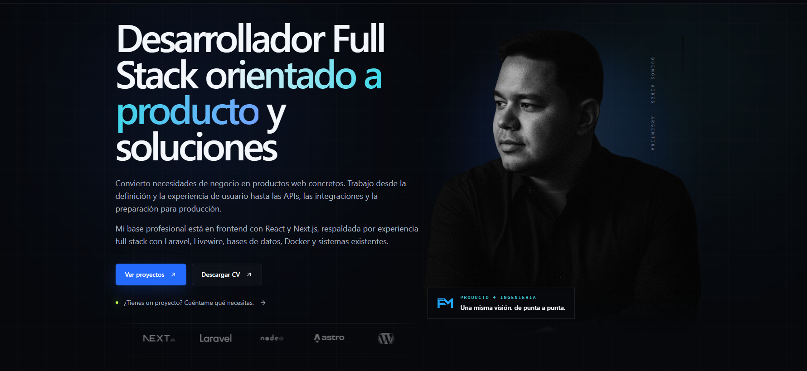

<div align="center">

<a href="https://felixmarquez.dev/">
  
</a>

<br />
<br />

# Félix Márquez — Portfolio Personal

<p align="center">
  <strong>Desarrollador Full Stack orientado a producto y soluciones</strong>
</p>

<p align="center">
  <a href="https://felixmarquez.dev/"><strong>felixmarquez.dev</strong></a> · 
  <a href="mailto:hola@felixmarquez.dev">hola@felixmarquez.dev</a> · 
  <a href="https://www.linkedin.com/in/felix-marquez-developer">LinkedIn</a>
</p>

<p align="center">
  
  
  
  
</p>

</div>

---

## 📌 Descripción

Repositorio oficial del portfolio web de **Félix Márquez**, Desarrollador de Software Full Stack. Diseñado y construido con una arquitectura moderna orientada a máxima velocidad de carga, experiencia de usuario fluida, diseño visual premium en modo oscuro y optimización para motores de búsqueda (SEO).

El sitio presenta casos de trabajo, trayectoria profesional, stack tecnológico, enfoque de desarrollo y un canal directo de contacto.

🌐 **Sitio en vivo:** [https://felixmarquez.dev/](https://felixmarquez.dev/)

---

## ✨ Características Principales

- **⚡ Rendimiento y Arquitectura Estática (SSG):** Desarrollado sobre **Astro 5**, entregando cero JavaScript por defecto hacia el cliente donde no es necesario, logrando puntuaciones sobresalientes en Core Web Vitals.
- **🎨 Tailwind CSS v4:** Implementación con la nueva especificación y motor `@tailwindcss/vite`, utilizando paleta personalizada (*ink*, *electric*, *signal*, *lime*, *paper*), tipografías modernas y variables de diseño nativas.
- **🖼️ Optimización de Recursos con Sharp:** Procesamiento automático de imágenes y logotipos a formatos de última generación (`.webp`), generando *srcsets* responsivos para diferentes densidades de pantalla.
- **🔄 Carrusel Marquee de Tecnologías:** Animación continua acelerada por hardware de los logos de tecnologías (*React, Next.js, Laravel, Node.js, Astro, WordPress, Playwright, OpenAI, Claude, Gemini*).
- **📬 Integración de Formulario de Contacto:** Conexión asíncrona a servicio API de envío de correos (`contactService.ts`), con validación de campos y manejo de estados (*enviando*, *éxito* y *reintento por error*).
- **🔍 SEO Avanzado y Datos Estructurados:**
  - Metadatos OpenGraph y Twitter Cards para previsualización enriquecida en redes sociales.
  - Esquema **JSON-LD Schema.org** completo (`Person`, `WebSite`, `WebPage`).
  - Generación automática de `sitemap-index.xml` mediante `@astrojs/sitemap`.
  - Iconos multiplataforma: Favicon SVG, PNG de alta densidad y `apple-touch-icon`.
- **📱 100% Responsivo y Accesible:**
  - Menú de navegación adaptable y logotipos responsivos (isotipo en pantallas móviles, imagotipo completo en escritorio).
  - Enlaces de salto al contenido principal (*Skip to content*).
  - Soporte completo para `prefers-reduced-motion`.

---

## 🛠️ Stack Tecnológico

| Capa | Tecnología |
| :--- | :--- |
| **Framework Web** | [Astro](https://astro.build/) v5+ |
| **Estilos** | [Tailwind CSS](https://tailwindcss.com/) v4+ (`@tailwindcss/vite`) |
| **Lenguaje** | [TypeScript](https://www.typescriptlang.org/) |
| **Animaciones** | [Motion](https://motion.dev/) & CSS Animations |
| **Iconografía** | [Astro Icon](https://github.com/natemoo-re/astro-icon) con [Lucide Icons](https://lucide.dev/) |
| **Procesamiento de Imágenes** | [Sharp](https://sharp.pixelplumbing.com/) |
| **Linters & Formato** | [ESLint](https://eslint.org/), [Prettier](https://prettier.io/) con plugin Astro |
| **Gestor de Paquetes** | [pnpm](https://pnpm.io/) / [npm](https://www.npmjs.com/) |

---

## 📁 Estructura del Proyecto

```text
felixmarquez-portfolio/
├── public/                     # Archivos estáticos públicos (favicons, manifest, etc.)
│   ├── favicon.svg
│   ├── favicon-96x96.png
│   └── apple-touch-icon.png
├── src/
│   ├── assets/
│   │   └── images/             # Imágenes y logos optimizados
│   │       ├── brands_logo/    # Logos de tecnologías en blanco/transparente
│   │       ├── home/           # Retrato y recursos visuales principales
│   │       ├── felix-marquez-logo-md.webp
│   │       └── iso-felix.png
│   ├── components/             # Componentes modulares Astro
│   │   ├── About.astro         # Sección Sobre Mí y Principios de Trabajo
│   │   ├── Capabilities.astro  # Capacidades técnicas de definición a entrega
│   │   ├── Contact.astro       # Formulario y canales de contacto directo
│   │   ├── Experience.astro    # Trayectoria profesional
│   │   ├── FinalCta.astro      # Llamado a la acción de cierre
│   │   ├── Footer.astro        # Pie de página con logo e hipervínculos
│   │   ├── Hero.astro          # Sección principal con propuesta de valor y badge
│   │   ├── Navbar.astro        # Barra de navegación fija con logo responsivo
│   │   ├── Process.astro       # Metodología y etapas de trabajo
│   │   ├── Projects.astro      # Casos de estudio y proyectos destacados
│   │   ├── Services.astro      # Oferta de servicios a medida
│   │   ├── TechStack.astro     # Marquee infinito de tecnologías
│   │   ├── WorkModes.astro     # Modalidades de colaboración
│   │   └── ui/                 # Componentes reutilizables (botones, encabezados)
│   ├── layouts/
│   │   └── Layout.astro        # Layout base con SEO, OpenGraph y scripts
│   ├── pages/
│   │   └── index.astro         # Página de inicio principal
│   ├── scripts/
│   │   └── animations.ts       # Controladores de animaciones con Motion
│   ├── services/
│   │   └── contactService.ts   # Servicio API para envío de mensajes
│   └── styles/
│       └── global.css          # Configuración de diseño y temas con Tailwind 4
├── .env.example                # Plantilla de variables de entorno requeridas
├── astro.config.mjs            # Configuración de Astro e integraciones
├── package.json
└── README.md
```

---

## 🚀 Instalación y Puesta en Marcha

### Prerrequisitos

- **Node.js**: `>= 22.12.0`
- **pnpm** (recomendado) o **npm**

### 1. Clonar el repositorio

```bash
git clone https://github.com/felixmarquez27/felix-marquez-portfolio.git
cd felix-marquez-portfolio
```

### 2. Instalar dependencias

```bash
pnpm install
# o con npm:
# npm install
```

### 3. Configurar variables de entorno

Crea un archivo `.env` basado en el archivo de ejemplo:

```bash
cp .env.example .env
```

Define tu identificador de cliente para el servicio de envío de formularios:

```env
PUBLIC_CLIENT_ID=tu-client-id-aqui
```

### 4. Iniciar el servidor de desarrollo

```bash
pnpm dev
```

Abre [http://localhost:4321](http://localhost:4321) en tu navegador para ver el resultado.

### 5. Compilar para producción

```bash
pnpm build
```

Los archivos estáticos optimizados listos para despliegue se generarán en la carpeta `dist/`. Para previsualizar la compilación de producción localmente:

```bash
pnpm preview
```

---

## 📋 Scripts Disponibles

| Comando | Descripción |
| :--- | :--- |
| `pnpm dev` | Inicia el servidor de desarrollo local con Hot Module Replacement (HMR). |
| `pnpm build` | Compila y optimiza el sitio estático para producción en `dist/`. |
| `pnpm preview` | Ejecuta un servidor local para inspeccionar la carpeta `dist/`. |
| `pnpm astro` | Acceso directo a la CLI de Astro (`astro add`, `astro check`, etc.). |

---

## 🌐 Despliegue

Al generar una salida estática (`output: "static"`), este proyecto puede desplegarse instantáneamente en cualquier proveedor de hosting moderno:

- **Vercel / Netlify / Cloudflare Pages:** Conectar el repositorio de GitHub y configurar el comando de build `pnpm build` y directorio de salida `dist`.
- **Servidor Propio / VPS (Ubuntu, Nginx, Docker):** Servir los archivos compilados del directorio `dist/` detrás de Nginx o un contenedor estático.

Asegúrate de configurar la variable de entorno `PUBLIC_CLIENT_ID` en el panel de control de tu proveedor de hosting.

---

## 📬 Contacto

Si deseas conversar sobre una posición profesional, un proyecto a medida o una colaboración técnica:

- **Sitio Web:** [felixmarquez.dev](https://felixmarquez.dev/)
- **Correo Electrónico:** [hola@felixmarquez.dev](mailto:hola@felixmarquez.dev)
- **WhatsApp:** [+54 11 3291-5296](https://wa.me/5491132915296)
- **LinkedIn:** [linkedin.com/in/felix-marquez-developer](https://www.linkedin.com/in/felix-marquez-developer)

---

<div align="center">
  <small>© 2026 Félix Márquez. Todos los derechos reservados.</small>
</div>
